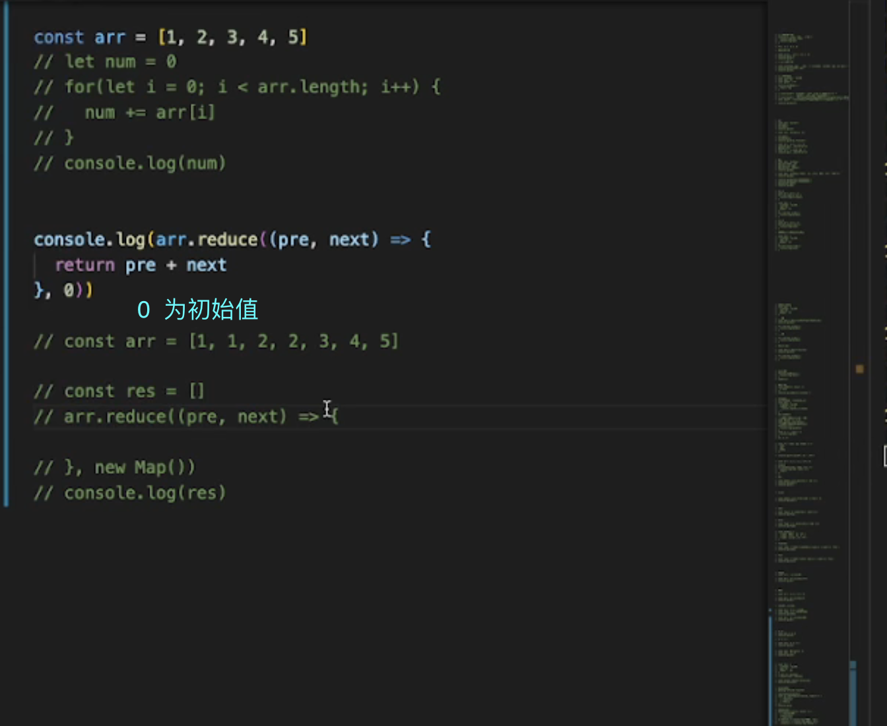
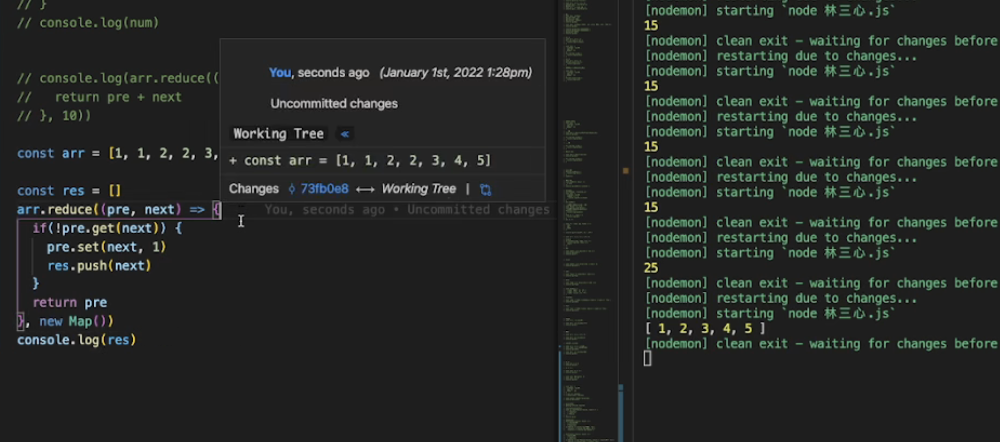

### reduce





- 接收两个函数

1. 第一个函数，包括pre（上一次的返回值）和next（数组的下一项）

2. 第二个参数 0 ，初始值，可以选择传或者不传，传就当作数组的第一项。比如【10，1，2，3，4，5】

- 【1，2，3，4，5】

```
pre:1 next:2

pre:3 next:3

pre:6 next:4

....

```

- 去重

