### 查看渲染

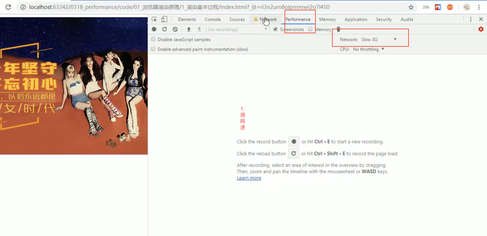
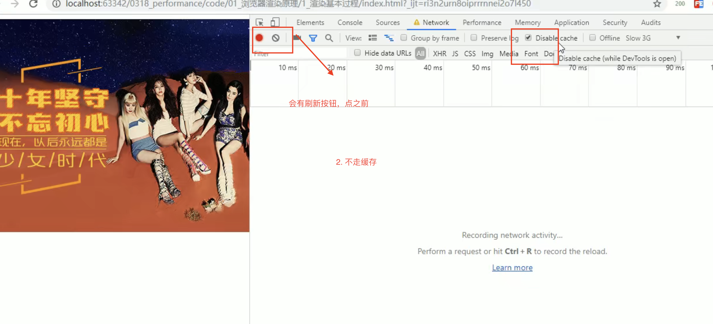
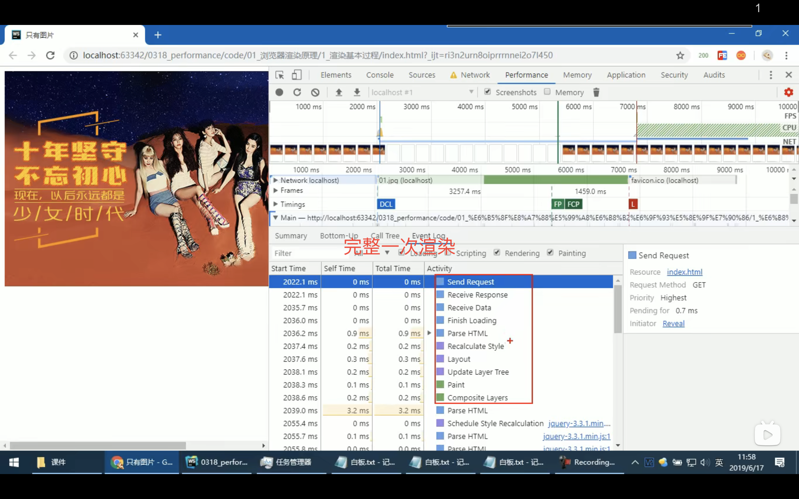
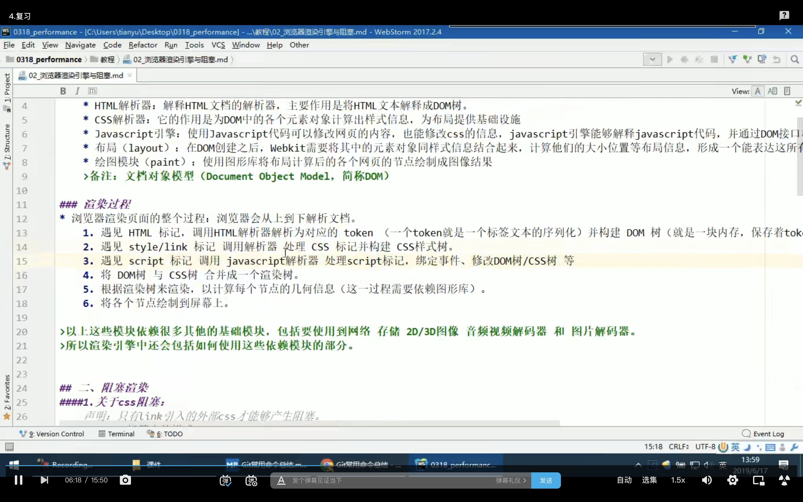

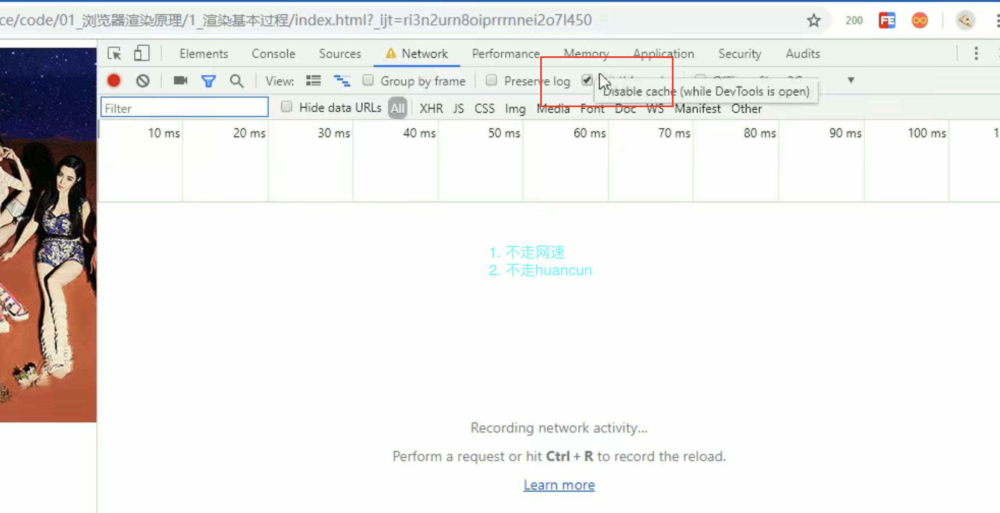

### [优化前端页面](https://www.bilibili.com/video/BV1CD4y1X7V5?p=4&vd_source=55f2748683e944b85c80a2f1a2c8cac3)

- 防止后台图片尺寸不同而影响页面

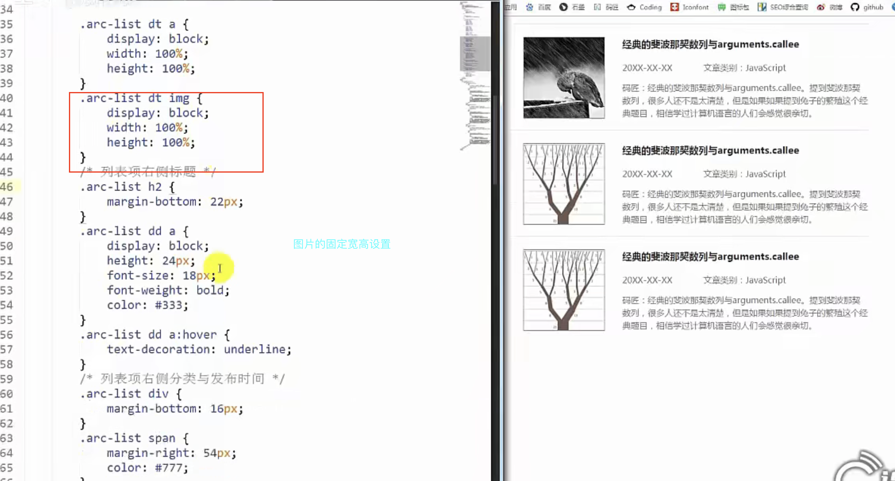

- overflow ， magin负值
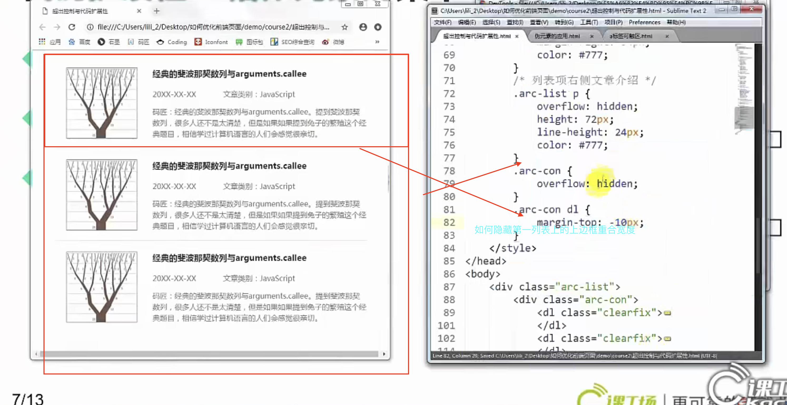

- first-child
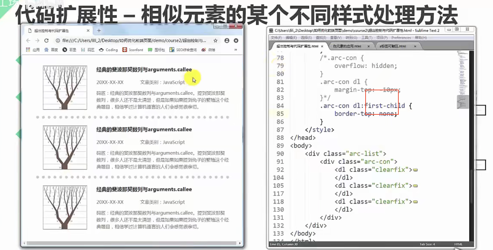

- 代码快速生成
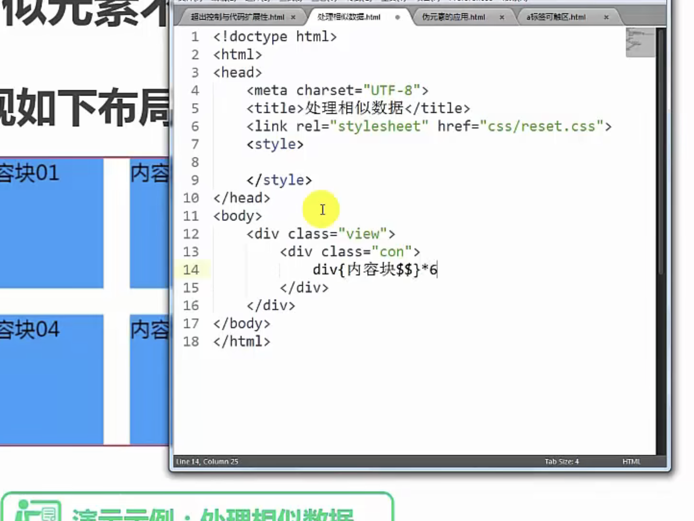
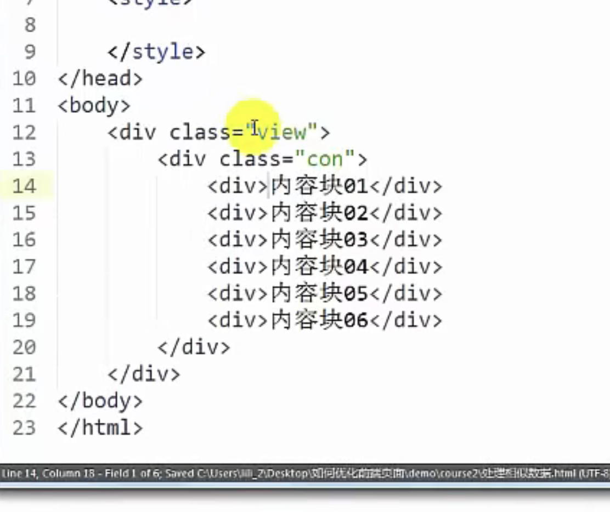
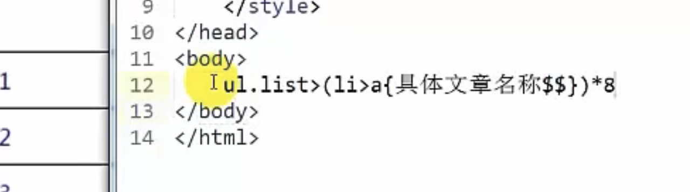
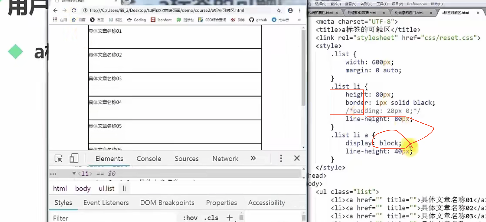
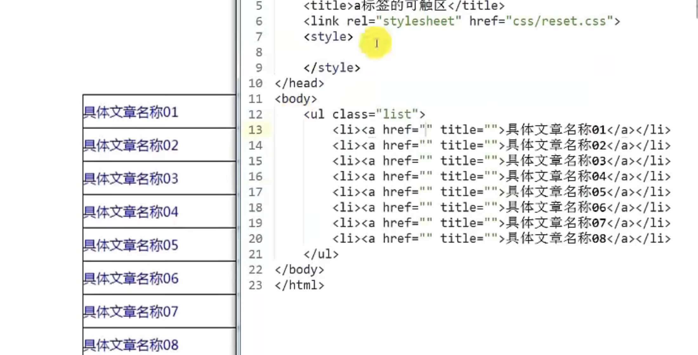

- 利用溢出隐藏和宽度计算差值 写页面

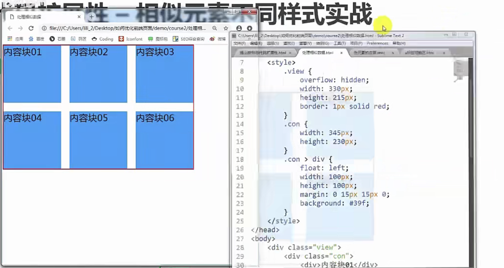

- 伪元素

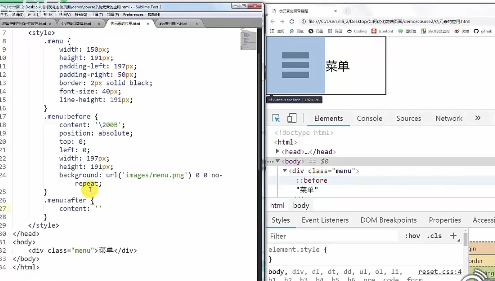

- a标签撑满相应父级

- sync（传入属性，和传入对象的写法。并且它是通过传入prop，并且可以监听。而且可以改变prop的值。）

### [彻底理解 vue 的 .sync 修饰符](https://www.bilibili.com/video/BV1WQ4y1q7be?spm_id_from=..search-card.all.click)

- 原理以及使用场景

- 使用

### 资料

> vue 双向绑定(v-model 双向绑定、.sync 双向绑定、.sync 传对象)

- [vue封装组件双向绑定](https://segmentfault.com/a/1190000040655672)
> @input="handleInput" :value="value1"

- [vue封装组件双向绑定](https://www.i4k.xyz/article/lucky___star/88565634)
> 定义组件时的 model 选项，从而实现了自定义组件 v-model 功能

- [vue 封装组件 实现自定义双向绑定](https://www.superweb999.com/article/1302892.html)
> 定义组件时的 model 选项，从而实现了自定义组件 v-model 功能

- [vue 封装组件 嵌套两层组件，最外面一层](https://www.superweb999.com/article/1302892.html)
> 定义组件时的 model 选项，从而实现了自定义组件 v-model 功能

- [vue 动态创建不同的组件 利用循环遍历 component is 解决问题](https://blog.csdn.net/jmszl1991/article/details/109366670)
- [vue 动态创建不同的组件 利用循环遍历 component is 解决问题](https://blog.csdn.net/H_O_W_E/article/details/111581331)

### b站其他

- [【Vue高级】sync修饰符的原理和作用](https://www.bilibili.com/video/BV1pV411S7GZ?spm_id_from=..search-card.all.click)

