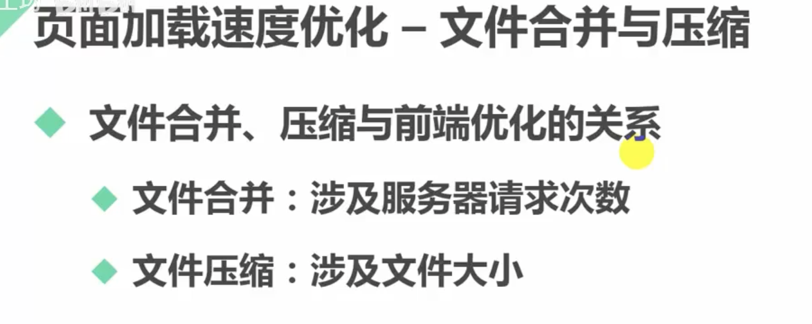
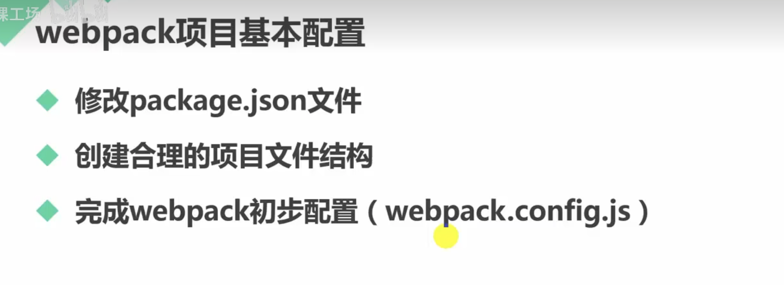
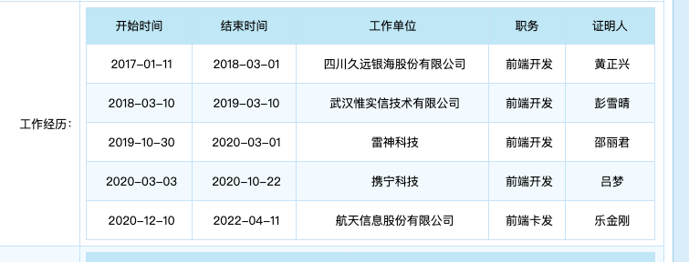
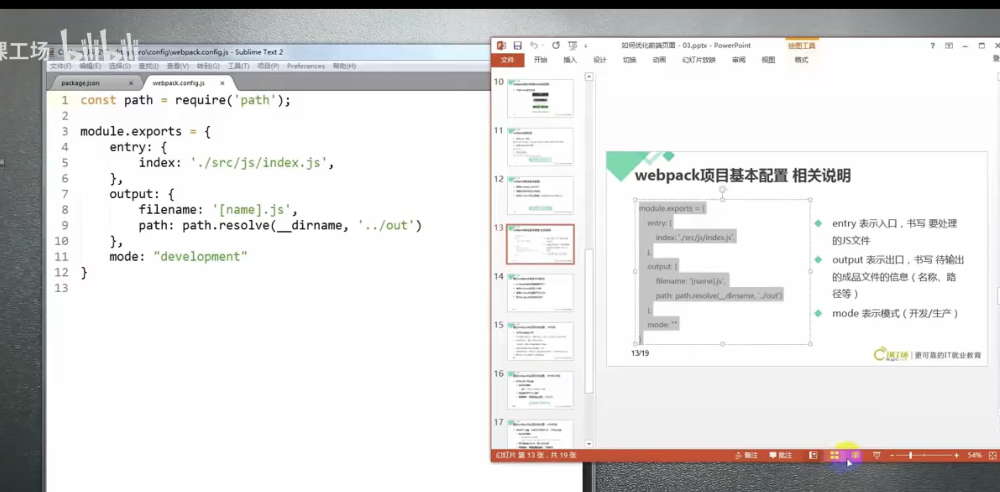

### 查看渲染


### [优化前端页面](https://www.bilibili.com/video/BV1CD4y1X7V5?p=4&vd_source=55f2748683e944b85c80a2f1a2c8cac3)

- 防止后台图片尺寸不同而影响页面


- overflow ， magin负值


- first-child


- 代码快速生成


- 利用溢出隐藏和宽度计算差值 写页面


- 伪元素


- a标签撑满相应父级


- webpack文件的压缩和合并

> 安装



> 配置


> webpack.config.js配置



```
./  表示package.json所在的位置
```