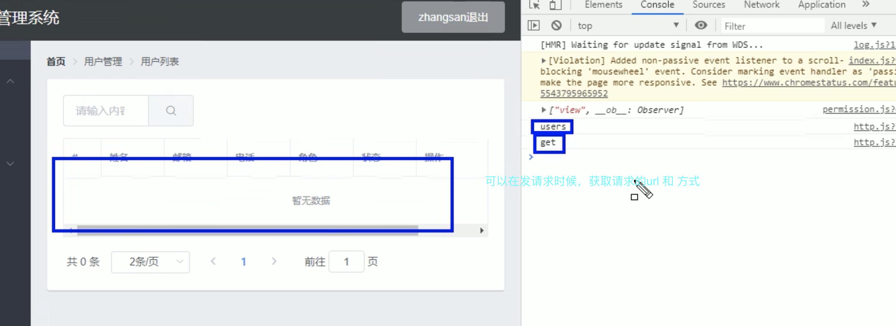
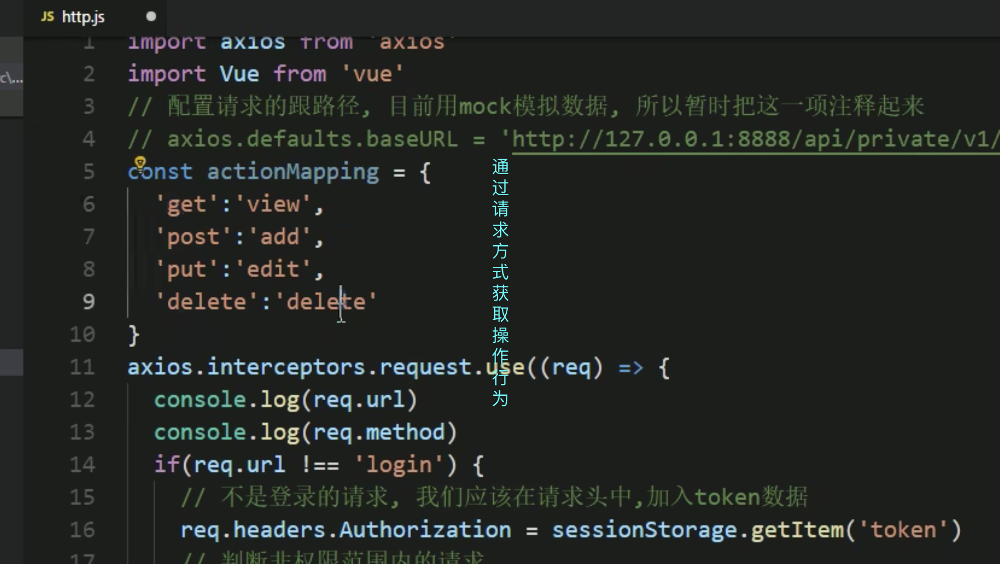
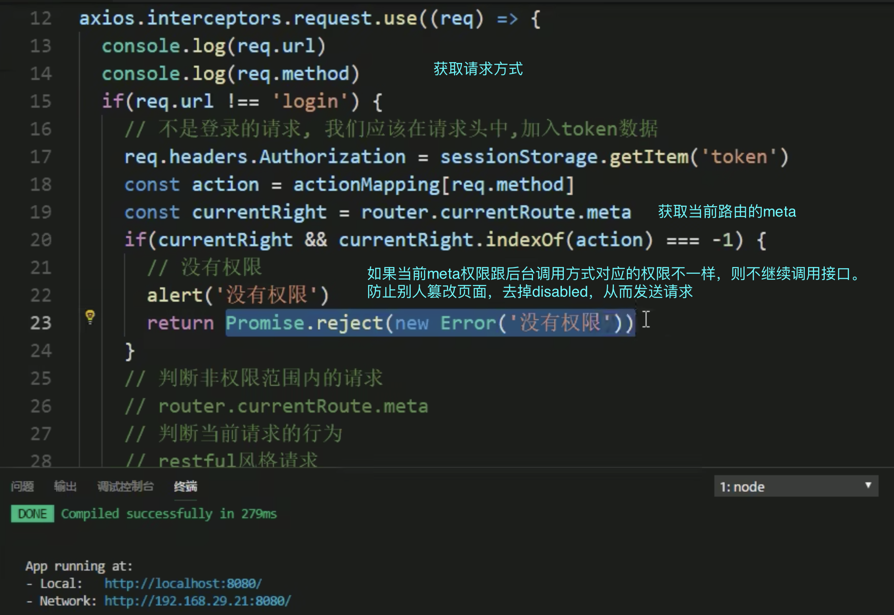

## [前端面试官必问系列-后台系统的权限控制与管理【完结】](https://www.bilibili.com/video/BV15Q4y1K79c?spm_id_from=..search-card.all.click&vd_source=55f2748683e944b85c80a2f1a2c8cac3)
### 权限控制内容

### 菜单控制

- vuex存储菜单权限。并通过computed映射state数据

- vuex结合sessionstorage 做数据持久化。session无法解决跨页问题。

- 如何退出登陆处理数据（crear，reload）

- 跳转页面前判断是否有token，决定是否去登陆页面

- 动态路由（因为前面都是直接判断token，再进入页面。但是有的不需要这种规则，需要动态的push进去路由里面，时机是在登陆成功后）

### 界面控制

### 按钮控制

- 自定义指令（利用meta）

### 请求和相应控制

- 响应控制，跳转404页面，当后台返回401

