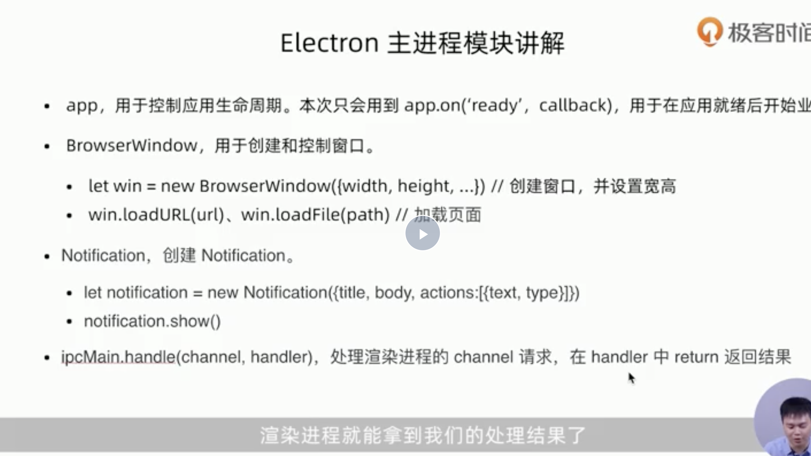
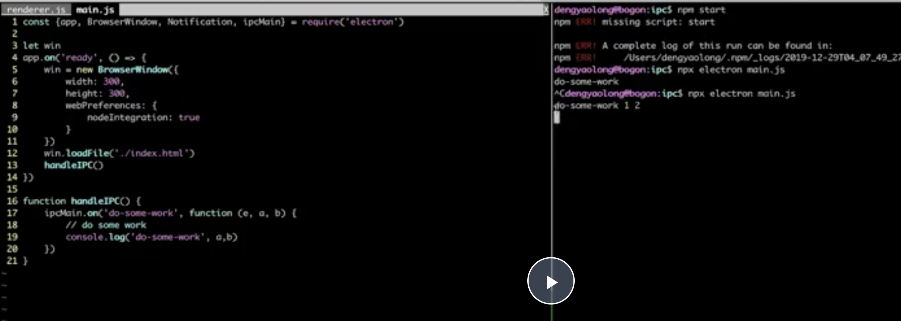

## electron基础

- 如何判断项目有无electron

  

- 简单架构
  

- 跨平台的技术  
  

- 安装electron
```
1. node 12.14.0

2. 32位的Node 打包 32 和 64位都可以用
```
  


## 番茄钟项目（主进程里面，监听各个进程的请求。）

- 每25分钟学习，5分钟休息
  

- 主进程和渲染进程
  
- 渲染进程讲解
  

```
ipcRender.invoke:可以向主进程发送响应，并且在等待的过程中，得到主进程的响应结果

```
- 主进程讲解

  

```
1. loadUrl: 加载远程页面
   lodFile: 加载本地页面
2. notification 中的actions  是按钮

3. handle 处理渲染进程的请求，并在handle后返回结果
```
  
  

## 与web开发的不同


设置两位，前面补0

- 主要的API方法，深色为重要的


```
app:生命周期

broseWindow：窗口

ipcMain：与ipcRender通信的

Menu，Tray，MenuItem：原生gui、

webcontent：加载具体页面

autoUpdate：更新模块

globalSglobalShortcut：设置全局快捷键

clipboard：读写剪切板

crashReport：监听主进程和渲染进程有没有崩溃

remote：可以调用主进程模块，但是建议大家不要使用

deskdesktopdesktopCapture：捕获我们的桌面流：截屏啊，屏幕的视频流啊


```

- 通信的不同

```
1. 通知信息：比如想在页面创建一个菜单，但是只有主进程才能创建菜单。所以只能就ipc进行进程间的通信

2. 数据传输：比如想获得当前的内存情况，就通过ipc来进行

3. 比如用户信息，在各个进程中都会用到，所以就通过ipcß

```


- 进程通信（跟上面番茄钟用法差不多，也可以穿参数）




- 从主进程到渲染进程


```
因为主进程不知道，是哪个发的，需要webcont获取窗体信息

```

- 进程和进程中的通信


```

1. 比如聊天微信窗口，打开文件窗口，关闭文件窗口需要发信息给聊天窗口

2. electron5之后用：ipcRender。sendTo 获取ID 发送信息

3. remote是存在全局里面的，用的不好会造成卡顿
```

- 经验技巧


```
当响应超时需要response一个异常，然后做对应的交互
```

- 原生能力


- 小技巧


```

可以在控制台敲Node命令
```

- 可以通过node-ffi集成 c++的动态库


- 其他功能


- 总结


- 兼容


```

谷歌浏览器自带的全天然的懒加载，滚动后才会具体加载图片
```

## 远程控制

- 业务流程


- 目录


- 加一个这个参数，不会在打开窗口出现浏览器跳转


- 通过这个库得知，到底是生产环境还是开发环境


- 不能在页面里面解析ipcRender的两种方法


- 模块安装 wait on 和 concurently（同时执行多个命令）


### 生成随机数，并且控制


### 桌视频流的捕获，桌面流的捕获

- 视频流的捕获


- 桌面流的捕获


### 指令的响应

- reboot。js


- 鼠标响应事件缩放
